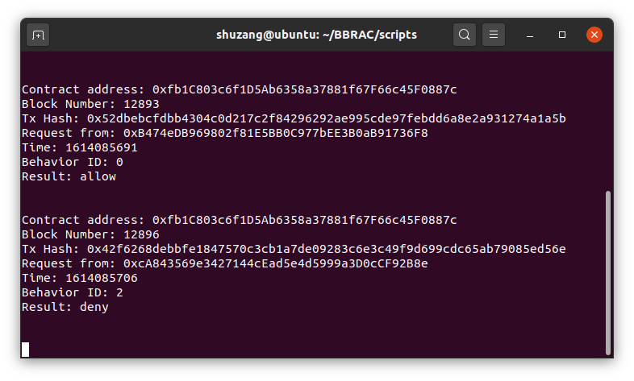
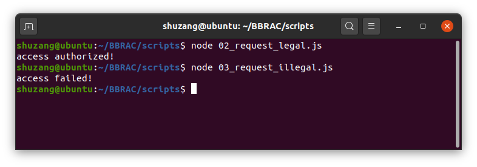

An attribute-based access control system. Implement in the Quorum blockchain using smart contract. Code and test in Remix, EVM version is byzantium, compiler version is 0.7.0, enable optimization and set 200 times. 

There are some deploy and test files in `truffle` folder. But truffle is limited and our different contracts have complex deployment and calling relationships. That is why we don't use truffle later.

## 1.数据统计

### 1.1 Deploy Gas

| 操作                 | transaction cost | 
| ------------------- | ---------------- | 
| Management.sol      | 2454563 gas      | 
| AccessControl.sol   | 3844394 gas      | 


### 1.2 Bytecode size

- Management.sol: 77,960 bytes(78.0 KB)
- AccessControl.sol: 121,454 bytes(121.5 KB)

## 2. 其他说明

Quourm network created by quorum-wizard. 
- choose simple network
- use bash scripts
- use istanbul consensus
- 4 nodes(minimum numbers of nodes)
- Quourm 2.7.0
- no Tessera
- use Cakeshop as chain explorer
- network name: 4-nodes-istanbul-bash

---

use `./start.sh` to start network   
use `./stop.sh` to stop network
use `./attach.sh number` to attach node, number is node's number

Cakeshop started at http://localhost:8999 after network started

rpc and websocket port define as follows

| Node  | rpcport | wsport|
|-------|---------|-------|
| Node1 |  22000  | 23000 |
| Node2 |  22001  | 23001 |
| Node3 |  22002  | 23002 |
| Node4 |  22003  | 23003 |

Remix connect using rpcport, web3 connect using wsport

## 3. deploy record

利用 Cakeshop 在 Node2 和 Node3 中新建一个账户，并转给新账户 1000 ETH

Node1 第一个账户部署 MC ，Node2 的两个账户分别是发起请求的设备和它的管理者，Node3 的两个账户分别是被请求的设备和它的管理者。

1. Node1 account0 deploy MC   
    deploy account: 0xed9d02e382b34818e88B88a309c7fe71E65f419d    
    return MC address: 0x1349F3e1B8D71eFfb47B840594Ff27dA7E603d17

4. Node2 account0 deploy ACC  
    deploy account: 0xcA843569e3427144cEad5e4d5999a3D0cCF92B8e 
    input:
    - MC address: 0x1349F3e1B8D71eFfb47B840594Ff27dA7E603d17
    - manager: 0xcA843569e3427144cEad5e4d5999a3D0cCF92B8e   

    return ACC address: 0x87Ec4E85245D901DE66C09c96Bd53C8146e0C12D

5. Node2 account1 deploy ACC  
    deploy account: 0xB474eDB969802f81E5BB0C977bEE3B0aB91736F8    
    input:
    - MC address: 0x1349F3e1B8D71eFfb47B840594Ff27dA7E603d17
    - manager: 0xcA843569e3427144cEad5e4d5999a3D0cCF92B8e   

    return ACC address: 0x43FF91eECdB11B8f7a2A2A65Bc64d934d8336BED

6. Node2 account0 register    
    call account: 0xcA843569e3427144cEad5e4d5999a3D0cCF92B8e   
    input:
    - device account: 0xcA843569e3427144cEad5e4d5999a3D0cCF92B8e
    - manager account: 0xcA843569e3427144cEad5e4d5999a3D0cCF92B8e
    - ACC address: 0x87Ec4E85245D901DE66C09c96Bd53C8146e0C12D
    - deviceID: gateway202
    - deviceType: gateway
    - deviceRole: non-validator

7. Node2 account1 register    
    call account: 0xcA843569e3427144cEad5e4d5999a3D0cCF92B8e   
    input:
    - device account: 0xB474eDB969802f81E5BB0C977bEE3B0aB91736F8
    - manager account: 0xcA843569e3427144cEad5e4d5999a3D0cCF92B8e
    - ACC address: 0x43FF91eECdB11B8f7a2A2A65Bc64d934d8336BED
    - deviceID: pallat23
    - deviceType: pallat
    - deviceRole: device


8. Node3 account0 deploy ACC     
    deploy account: 0x0fBDc686b912d7722dc86510934589E0AAf3b55A    
    input:
    - MC address: 0x1349F3e1B8D71eFfb47B840594Ff27dA7E603d17
    - manager: 0x0fBDc686b912d7722dc86510934589E0AAf3b55A   

    return ACC address: 0x9E966663fCA74605357e328994D29a3D6D614C2F

9. Node3 account1 deploy ACC  
    deploy account: 0x0c9Fd5f5212D15dcaE054a798c1C0916D286d58a    
    input:
    - MC address: 0x1349F3e1B8D71eFfb47B840594Ff27dA7E603d17
    - manager: 0x0fBDc686b912d7722dc86510934589E0AAf3b55A   

    return ACC address: 0xfb1C803c6f1D5Ab6358a37881f67F66c45F0887c

10. Node3 account0 register   
    call account: 0x0fBDc686b912d7722dc86510934589E0AAf3b55A   
    input:
    - device account: 0x0fBDc686b912d7722dc86510934589E0AAf3b55A
    - manager account: 0x0fBDc686b912d7722dc86510934589E0AAf3b55A
    - ACC address: 0x9E966663fCA74605357e328994D29a3D6D614C2F
    - deviceID: gateway203
    - deviceType: gateway
    - deviceRole: non-validator

11. Node3 account1 register   
    call account: 0x0fBDc686b912d7722dc86510934589E0AAf3b55A   
    input:
    - device account: 0x0c9Fd5f5212D15dcaE054a798c1C0916D286d58a
    - manager account: 0x0fBDc686b912d7722dc86510934589E0AAf3b55A
    - ACC address: 0xfb1C803c6f1D5Ab6358a37881f67F66c45F0887c
    - deviceID: truck34
    - deviceType: truck
    - deviceRole: device

12. Node3 account1 addPolicy  
    call account: 0x0fBDc686b912d7722dc86510934589E0AAf3b55A   
    input:
    - resource: basicInformation
    - action: read
    - attribute owner: subject
    - attribute name: deviceID
    - operator: =
    - attribute value: pallat23

13. Node2 account1 access test(passed)
14. Node2 account0 access test(passed)

## 4. use script

web3.js is necessary when we execute scripts, install it in root directory. All scripts are in scripts folder.

```
# 1.2.8 is the only version we tested successfully
$ npm install web3@1.2.8
```

After then, Execute the first script to verify the connection


Execute the fourth script to monitor result.



Execute the second and the third script in order.



