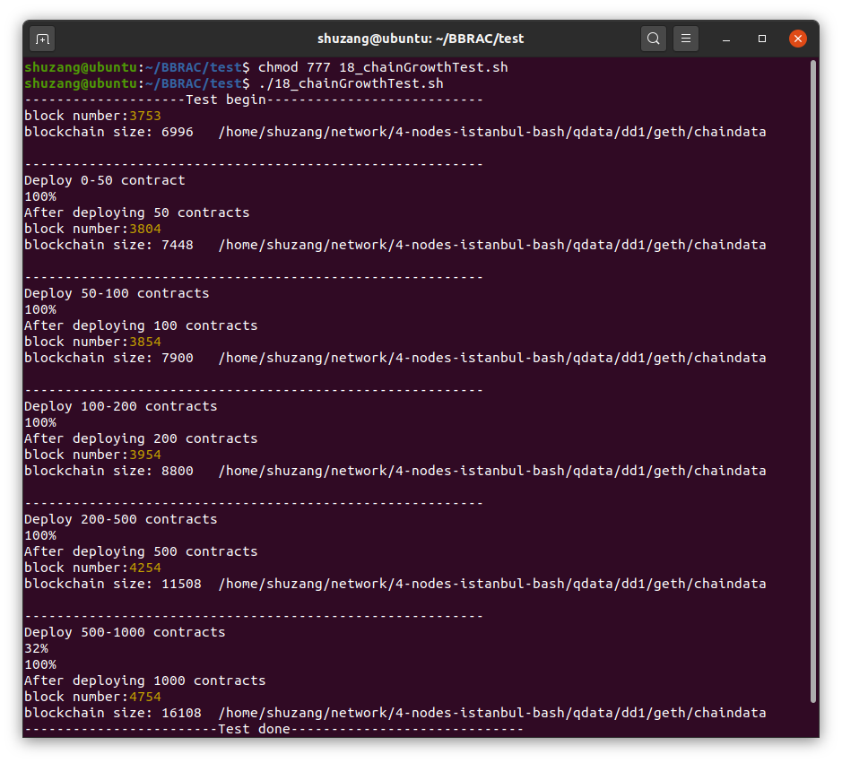

Use truffle for testing, deployment, and interaction. The test development is based on Ganache, the actual deployment interaction is based on Quorum, the Solidity compiler version is 0.7.0, code optimization is enabled, and the evm version is byzantium.

This branch is a reproduction of the following papers:

> Wang P, Yue Y, Sun W, e.g. An Attribute-Based Distributed Access Control for Blockchain-enabled IoT[C/OL]//2019 International Conference on Wireless and Mobile Computing, Networking and Communications (WiMob). Barcelona, Spain: IEEE, 2019: 1–6[2020–04–02]. https://ieeexplore.ieee.org/document/8923232/. DOI:[10.1109/WiMOB.2019.8923232](https://doi.org/10.1109/WiMOB.2019.8923232).

## 1. Deploy Gas

- Subject.sol: 808091 gas
- Object.sol: 451818 gas
- Policy.sol: 1625667 gas
- AccessControl.sol: 1311810 gas

## 2. Bytecode size

- Subject.sol: 23,760 bytes(23.8 KB)
- Object.sol: 12,431 bytes(12.4 KB) 
- Policy.sol: 49,978 bytes(50.0 KB)
- AccessControl.sol: 40,086 bytes(40.1KB)

## 3. Test record

1. Node1(manager：0xed9d02e382b34818e88B88a309c7fe71E65f419d)
   - Deploy SC，get SC Address：0x1349F3e1B8D71eFfb47B840594Ff27dA7E603d17
   - Deploy OC，get OC Address：0x9d13C6D3aFE1721BEef56B55D303B09E021E27ab
   
2. Node2(User：0xcA843569e3427144cEad5e4d5999a3D0cCF92B8e)
   
   - deploy PC，get PC Address：0x87Ec4E85245D901DE66C09c96Bd53C8146e0C12D
   
3. Node1 create three new accounts
   - M(Manufacturer)：0xa4040cee0cf30de69a9fc617fea49f5ec29034cd
   - Subject1：0xd7107dd68050e7e35dabae85cbc9d3b83be4c8e2
   - Subject2：0x84234d3e4d7f73c81b043c2e622338f67915df77
   
4. Node1(manager)
   
   - Call SC，Add M to legal manaufacturers lists
   
5. Node1(M：0xa4040cee0cf30de69a9fc617fea49f5ec29034cd)
   - Call SC，register Subject1，input MA `[type:remotecontrol][mac:00efefefefef]`
   - Call SC，register Subject2，input MA `[type:remotecontrol][mac:00da7eef12ef]`
   
6. Node2 create a new account
   
   - Object1：0xb474edb969802f81e5bb0c977bee3b0ab91736f8
   
7. Node2(Object1)
   - Call OC，set OA，passed params `[type:TV][location:living]`
   - Call SC，set SOA for Subject1，passed  `[group:owner][role:parent]`
   - Call SC，set SOA for Subject2，passed ` [group:owner][role:chlidren]`
   
8. Node2(User)
   - Call PC，add Policy
     - resource：switch
     - action：on
     - duty：record
     - algorithm：denyoverrides
   - Call PC，add Rule1
     - sa：`[type:remotecontrol][mac:00efefefefef][group:owner][role:parent]`
     - oa：`[type:TV][location:living]`
     - ea：`[time:*-*]`
     - result：allow
   - Call PC，add Rule2
     - sa：`[type:remotecontrol][mac:00da7eef12ef][group:owner][role:chlidren]`
     - oa：`[type:TV][location:living]`
     - ea：`[time:21:00-23:00]`
     - result：deny
   
9. Node1(manager)

   - Deploy ACC，passed SC and OC Address，get ACC address：0xFe0602D820f42800E3EF3f89e1C39Cd15f78D283

   - Call ACC，set EA，`[time:*-*]`

10. Node2(Object1)

    - Call ACC，bind PC and Object1

11. Node1(Subject1)

    - Call ACC，send request, result should be "allow"

12. Node1(manager)

    - Call ACC，set EA，`[time:21:00-23:00]`

13. Node1(Subject2)

    - Call ACC，send request, result should be deny

## Test

